# Get Imagick Extension Detail
```
php --ri imagick
```

# Imagick 8.2

```
https://github.com/Imagick/imagick/issues/573
```

```
https://www.webappfix.com/post/error-you-need-to-install-the-imagick-extension-to-use-this-back-end.html
```

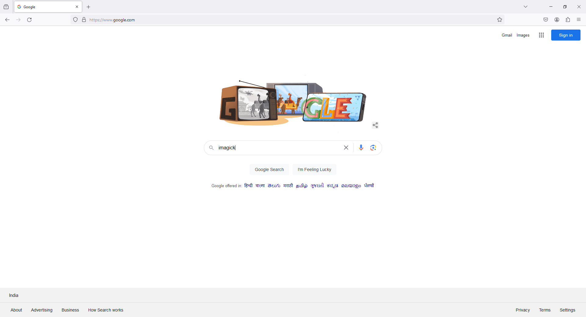
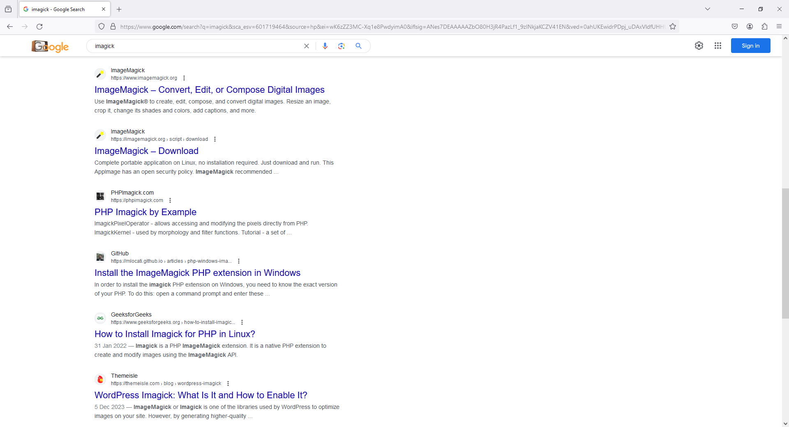
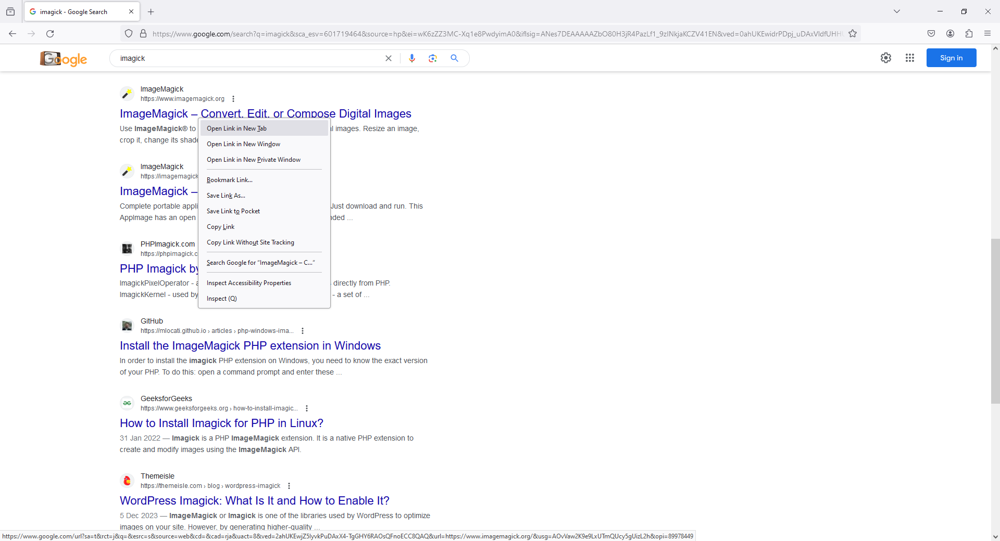

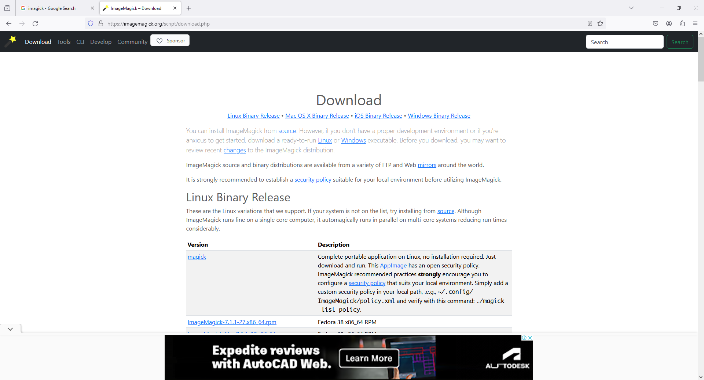
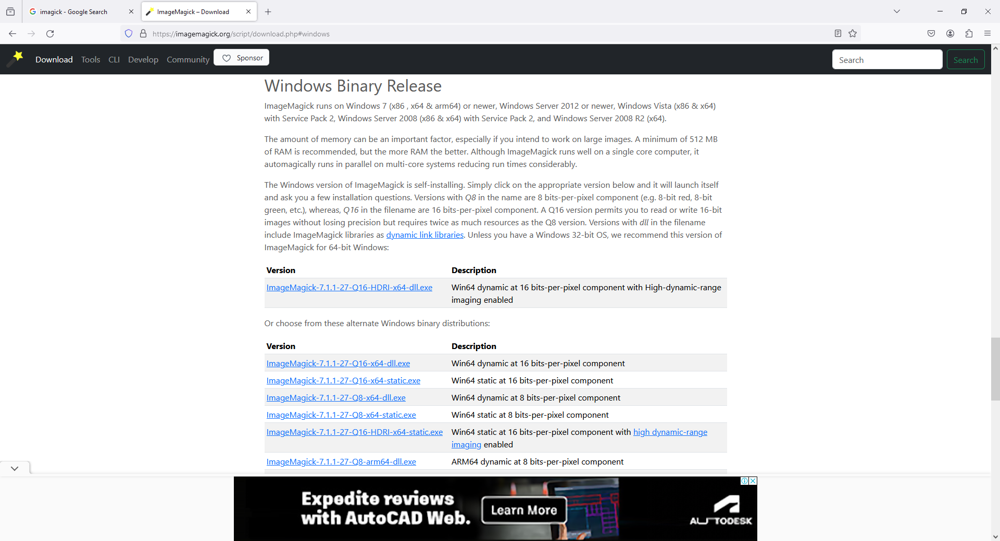
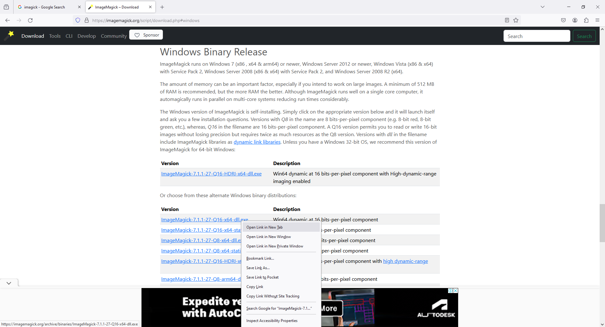
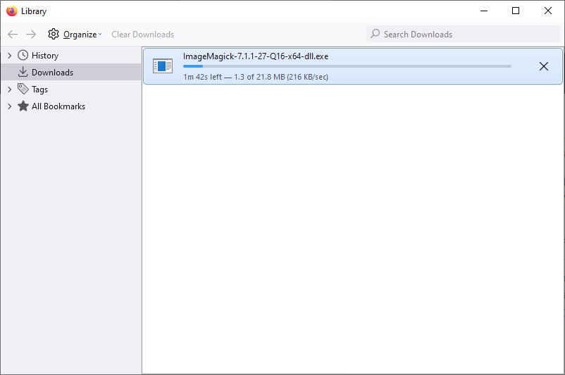
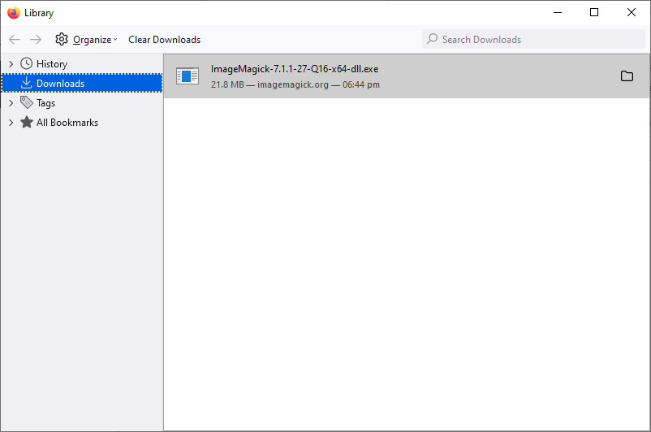
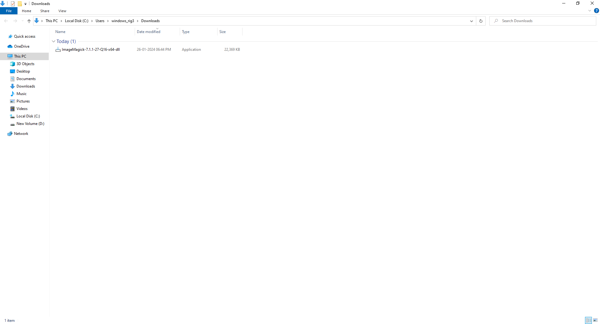
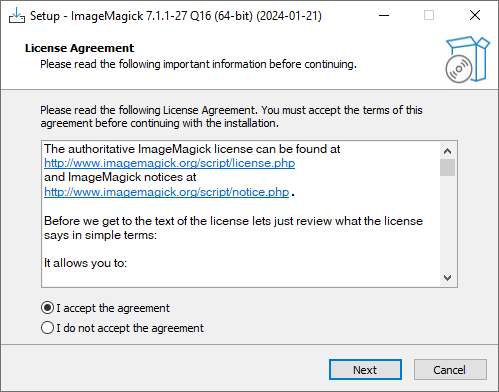
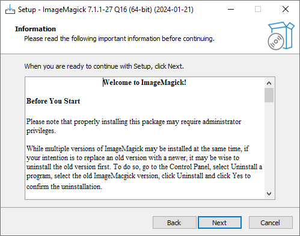
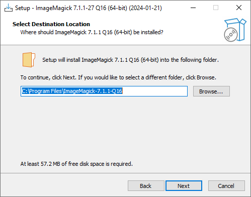
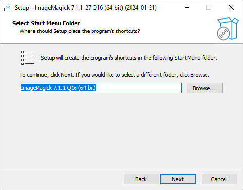
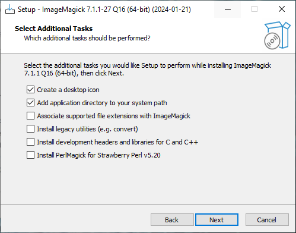
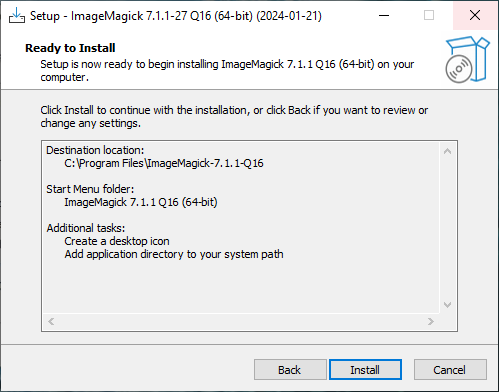
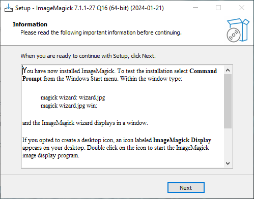
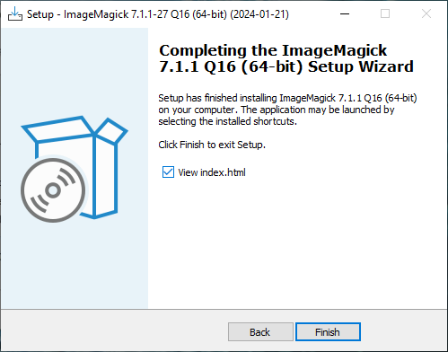